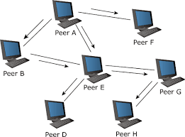
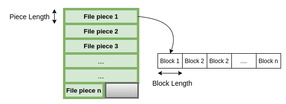
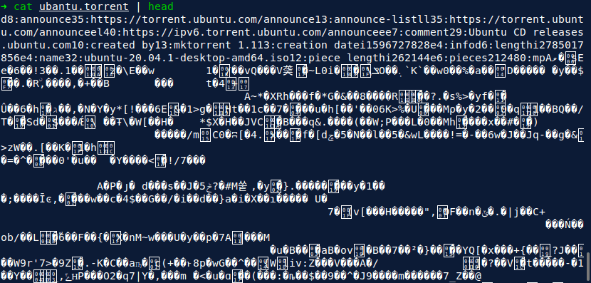
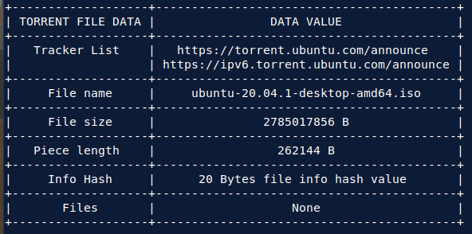
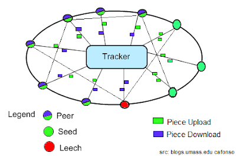
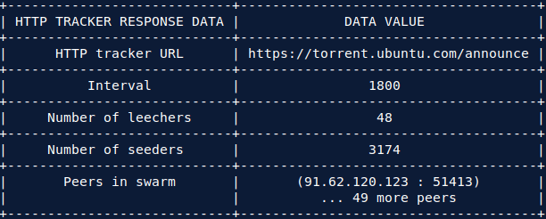
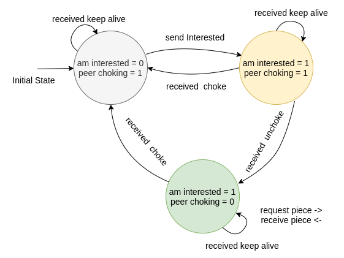
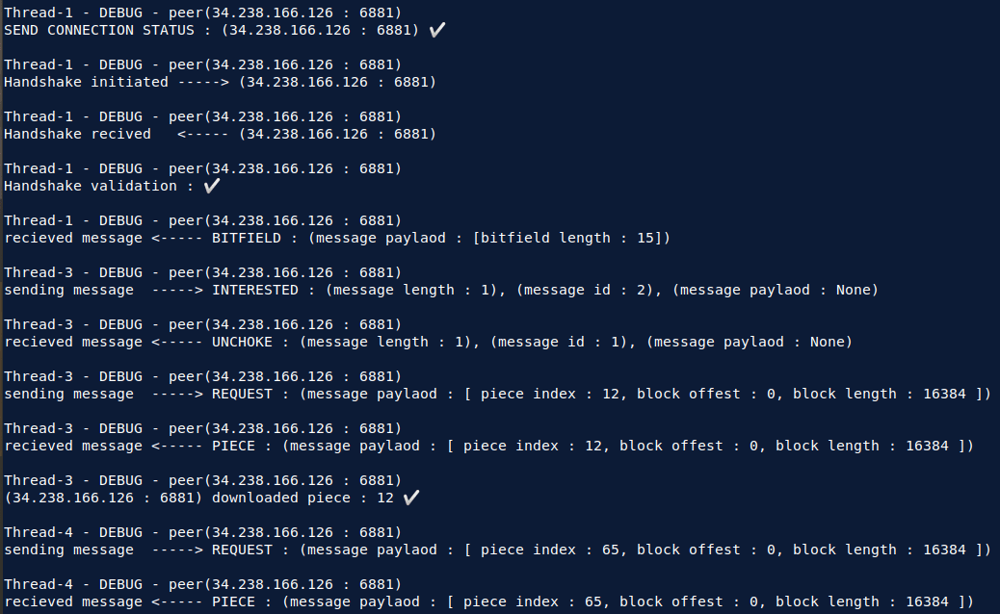

<h1 align="center">kp-torrent</h1>

<div align="center">
    <a href="https://wiki.theory.org/index.php/BitTorrentSpecification">
        
    </a>
</div>

<div align="center">
  <strong>Bittorrent Client</strong>
</div>
<br />

<div align="center">
  
 [](https://opensource.org/licenses/MIT)
 [](https://www.python.org/)
 
</div>
  
<div align="center">
  <sub>Built by
  <a href="https://github.com/kishanpatel22">Kishan Patel</a> and
</div>

## Installation and Build :hammer_and_wrench:

* Clone is repository on your local unix machine and step in the main directory
```
    $ git clone https://github.com/kishanpatel22/bittorrent.git
    $ cd bittorrent
```

* If you don't have pipenv package then install it using command, else ignore below command
```
    $ pip3 install pipenv
```

* Enter the virtual enviornment and install all dependencies 
```
    $ pipenv shell
    $ pipenv install --dev
```

## Run :computer:

* Change directory to source in bittorrent folder and inorder to display help options 
```
    $ cd src
    $ python3 main.py --help
```

* Example for downloading torrent file given destination path for downloading file
```
    $ python3 main.py input_file.torrent -d destination_path/
```

* Example for seeding torrent file given given destination path of existing file
```
    $ python3 main.py input_file.torrent -s existing_file_path/
```


## Motivation 

* Downloading movie, music perhaps game or very large size software if pretty
  fun activity using **Bittorrent communication protocol** which helps in
  distributing large chunks of data over Internet. Fact is that **one third of
  internet traffic contains Bittorrent data packets**, which makes it one of 
  most interesting and trending topics.

## Peer-to-Peer(P2P) Architecture

* Traditional client-server model is obviously not scalable when many clients
  are requesting single server, this leads us to P2P architecture in which instead
  of centrailzed server, peers or clients or end hosts itself participate in 
  distributing data among themself.
  
  Peer-to-Peer Architecture                             |
  :----------------------------------------------------:|
          |

* Bittorrent is protocol defined for sharing/exchange of data in peer to peer
  architecture designed by designed by **Bram Cohen**. The purpose of Bittorrent
  Protocol or BTP/1.0 was to achieve **advantage over plain HTTP when multiple
  downloads are possible**. I would recommend reading this page which gives
  details about [BTP/1.0](https://wiki.theory.org/index.php/BitTorrentSpecification)

## Applications of Bittorrent

* Amazon Web Services(AWS) **Simple Storage Service**(S3) is scalable internet
  based storage service with interface equipped with built-in Bittorrent.

* Facebook uses BitTorrent to distribute updates to Facebook servers.

* Open-source free software support their file sharing using Bittorrent 
  inorder to reduce load on servers. Example - ubantu-iso files.

* Government of UK used Bittorrent to distribute the details of the tax money
  spend by the cittizens.

**Fun Fact** - In 2011, BitTorrent had 100 million users and a greater share 
  of network bandwidth than Netflix and Hulu combined.

## [Bittorrent Client](https://en.wikipedia.org/wiki/BitTorrent)

* **Bittorrent protocol is application layer protocol**, since it replies on the
  services provided by the lower 4 levels of TCP/IP Internet model for sharing
  the data. It is the application layer where the Bittorrent Client is written
  such that following a set of rules or protocols it will exchange the data
  among the peers(ends hosts).

* In the project, I have made bittorrent client application program in
  python3, which follows the Bittorrent protocols for downloading and
  uploading files among serveral peers. 

## Bittorrent File distribution process entities

| Entity Names      | Significance                                                                                              |
|-------------------|-----------------------------------------------------------------------------------------------------------|
| **.torrent file** | contains details of trackers, file name, size, info hash, etc regarding file being distributed            |
| **Tracker**       | It keeps state of the peers which are active in swarm and what part of files each peer has                |
| **peers**         | End systems which may or may not have compelete file but are participating the file distribution          |
| **PWP**           | protocol that end system need to follow inorder to distribute the file among other peers                  |

* Peers participating in file sharing lead into dense graph like structure
  called **swarm**. The peers are classified into two types leechers(one who
  download only) and seeders(one who upload only).

* The large file being distributed is **divided into number of pieces** which
  inturn is divided into number of different chunks/blocks. The data chunks/blocks 
  are actually shared among the peers by which the whole file gets downloaded.

  Distribution of large file in pieces                          |
  :------------------------------------------------------------:|
      |

### Bittorrent tasks

* [**Parising .torrent**](#reading-torrent-files) : Get .torrent file after that 
  read the .torrent file and decode the bencoded information. From the extracted 
  information get Tracker URLs, file size, name, piece length, info hash, 
  files(if any), etc.

* [**Tracker**](#tracker) : Communicate with the trackers inorder to know which 
  peers are participating in the download. The tracker response contains the peer 
  information which are currently in the swarm.

* [**PWP**](#peer-wire-protocol) : Peer wire Protocol (PWP) is used to communicate 
  with all the peers and using peer wire messages(PWM) and download file pieces 
  from the peers.

### [Reading torrent files](https://wiki.theory.org/index.php/BitTorrentSpecification#Metainfo_File_Structure)

* Files have extention .torrent and contain data about trackers URL, file name,
  file size, piece length, info hash and some additional information about 
  file being distributed.

* Torrent files are bencoded thus one requires to parse the torrent file and
  extract the information about the orginal file being download. Thus
  bittorrent client needs write parser for decoding torrent files.

* Torrent files can be generated for single/multiple files being distributed.
  The given below image is output of the torrent parser, however note the
  torrent file may contain much more data value than as displayed in image.

  Torrent file bencoded data                |  Torrent file decoded data
  :----------------------------------------:|:-------------------------:
     |  


### [Tracker](http://jonas.nitro.dk/bittorrent/bittorrent-rfc.html#anchor17)

* Bittorrent client needs to know which all peers are participating in swarm 
  for distributing the file. The Tracker is server which keeps the track of all
  the peers joining, leaving or currently active in the swarm.

* Tracker also knows how many seeders and leetchers are prenent in the swarm
  for distributing a pariticular torrnet file. However note that the tracker
  doesn't actual have the torrent file.
    
  Centrailized Tracker                  |
  :------------------------------------:|
        |

  + [**HTTP/HTTPS trackers**](https://wiki.theory.org/index.php/BitTorrentSpecification#Tracker_HTTP.2FHTTPS_Protocol)
    * Trackers which speak the HTTP protocol for responding the swarm(all the
      peers) information. 
    * Client needs to do HTTP get request to the tracker and recieved HTTP 
      response containing information about the swarm.
    * Such type of tracker introduces significant overhead when dealing with
      multiple clients at time.

  + [**UDP trackers**](https://libtorrent.org/udp_tracker_protocol.html)    
    * Trackers which speak UDP protocol, such type of trackers are optimized
      and provide less load on tracker severs.
    * Since UDP is stateless and provides unreliable service to clients we need
      to make multiple request to tracker.
    * Client needs to communicate twice to the UDP tracker, once for connection
      ID and subsequently using that connectionID recieved for annouce request 
      for getting swarm information.

* Trackers urls in torrent files can be absoulte, so client needs to communicate
  with all trackers unless it recieves swarm data.

* A typical tracker response contains random 50 or less peers in the swarm along 
  with some additional parametes as given below. 
  
  Tracker Response                                      |
  :----------------------------------------------------:|
      |


## [Peer Wire Protocol(PWP)](https://wiki.theory.org/BitTorrentSpecification#Peer_wire_protocol_.28TCP.29)

* According to BTP/1.0 PWP facilitates the exchange of pieces of the file. The
  Bittorrent Client maintains the **state information** for each connection 
  that it has with a remote peer.

  States            |  Signifance
  :----------------:|:-------------------------:
  am choking        | client is choking the peer
  peer choking      | peer is choking the client
  am interested     | client interested in peer
  peer interested   | peer interested in client
 
* Choking here means peer or client being choked will not recieve messages for 
  their request until unchoke message is recieved.
  
  peer choking                                                 | peer unchoking
  :-----------------------------------------------------------:|:-------------------------:
    | 

* Initial state of client for **downloading** will be **peer choking = 1** and 
  **client interested = 0**, similarly for **uploading** the state will be 
  **client choking = 1** and **peer interested = 0**. Now we start
  communicating with peer with these states using **Peer Wire Messages** (PWM)

#### [Peer Wire Messages](http://jonas.nitro.dk/bittorrent/bittorrent-rfc.html#anchor20)

* All the peer wire message are send over TCP connection which provides inorder
  and reliable bidirectional data communication.

* **Question : The peer IP and port addresses recieved from tracker will be
  behind the NATED gateway how are you going to establish TCP connection ?**


  Message           |  Signifance
  :----------------:|:-------------------------:
  handshake         | Initial message to be shared after TCP connection
  keep alive        | message indicating that the peer connection is still active
  choke             | peer is choking client
  unchoke           | peer is unchoking client
  interested        | peer is interested in client
  uninterested      | peer is uninterested in client
  bitfield          | pieces that peer has
  have              | piece that peer has
  request           | request for piece to peer
  piece             | piece data response from peer

* Along with these there are few more PWM which are not discussed since they
  are not implemented in the code. The ideal sequence or exchange of message
  after establishing successful TCP connection are given below

|Message Sequnece |   Client side     |     to/from      |    Peer side        |
|-----------------|-------------------|------------------|---------------------|
|1                | Handshake request |      --->        |                     |
|2                |                   |      <---        | Handshake response  |
|3                |                   |      <---        | Bitfield            |
|4                |                   |      <---        | Have(optional)      |
|5                | Interested        |      --->        |                     |
|6                |                   |      <---        | Unchoke/Choke       |
|7                | Request1          |      --->        |                     |
|8                |                   |      <---        | Piece1              |
|9                | Request2          |      --->        |                     |
|10               |                   |      <---        | Piece2              |
|k                | ...               |      --->        |                     |
|k + 1            |                   |      <---        | ...                 |


* However this is ideal case where all the validation of peer wire message is
  successful and peer TCP connection is not closed. Example peer could send
  choke message in that case subsequent message will get not reply, and
  sometimes even handshake message are invalid !

* Inorder to solve such issues Downloading Finite State Machine is designed 
  taken into consideration the order in which the messages are exchanged and 
  client state. The Finite state machine with each state having timeout is 
  implemented as given below

  Finite State Machine for downloading                          |
  :------------------------------------------------------------:|
      |

* Typical sequence of event for the downloading woudl look like as given below.

  Sequence of messages in Downloading                           |
  :------------------------------------------------------------:|
      |

* **Question : How to write into file after receiving the piece message ?**
  The solution is initialize the file with the size with null values and as and 
  when you recieve any of the pieces from the peers write at the proper
  location in the file. What to generate is file with many holes.

#### Downloading torrent file demo

  [](https://asciinema.org/a/yVvtbuvsPJc0tVQYPkwNVVXY9)


## Legal issues with BitTorrent

* Firstly torrenting is Legal ! It is the protocol used in peer to peer
  architecture, but the problem is in the content that we share on torrent that 
  needs to monitored and must hold permission to share by owner.

* Copyrighted contents like any new NetFlix web series, any new movie, songs, 
  some gamming softwares, etc generate many legal issues since first of all
  downloading such copyrighted content is illegal (owner can sue you). And it 
  is actually very hard to monitor over internet the copyrighted bittorrent 
  traffic, there is even no way to know which people have copy righted content.

* Make sure whatever you download by Bittorrent doesn't have such issues, and
  lastly **enjoy torrenting !**.

